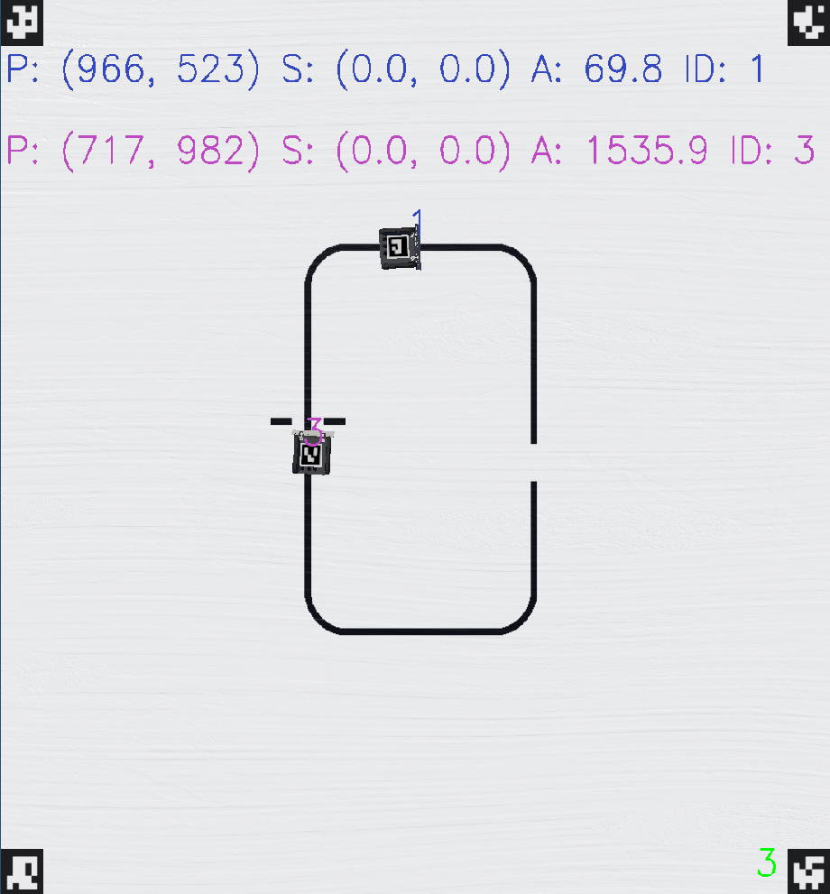

# SpaceShipRadar - Localization of mobile robots via OpenCV <!-- omit in toc -->

[](https://choosealicense.com/licenses/bsd-3-clause/) [](https://www.repostatus.org/#wip) [](https://github.com/NewTec-GmbH/SpaceShipRadar/actions/workflows/test.yml)

- [Overview](#overview)
- [Installation](#installation)
- [Usage](#usage)
- [Examples](#examples)
- [SW Documentation](#sw-documentation)
- [Used Libraries](#used-libraries)
- [Issues, Ideas And Bugs](#issues-ideas-and-bugs)
- [License](#license)
- [Contribution](#contribution)

## Overview

The Space Ship Radar is a Python script designed to initialize a Webots camera and track ArUco markers within its field of view. The system accurately determines the position (P) of the markers in millimeters. Additionally, it tracks the speed (S) of the markers and measures their orientation angle in milliradians (mrad).





### States


The System starts in the Configuration-State where the user can adjust certain values before the 
tracking begins. At the moment the user can adjust the size of the edge-markers in mm.  

Then if the configuration is complete any key can be pressed to proceed to the tracking-state.
Here the objects will be tracked and displayed.  

To quit the program you can press the q-key in the tracking-state.

## Installation

```bash
git clone https://github.com/NewTec-GmbH/SpaceShipRadar.git
cd SpaceShipRadar
pip install .
```

## Usage

### Setup .env

#### 1. Rename the File:

Locate the file named template.env in your project directory.
Rename this file to .env. This is important as the application will look for this specific filename.

#### 2. Adjust the Paths:

Open the newly renamed .env file in a text editor.
You will see several lines that specify paths. You need to update these paths to point to the correct locations on your system.

#### 3. Set the Path for RadonUlzer Executable:

Find the line that starts with RadonUlzer_PATH=.
Change it to reflect the absolute path where program.exe is located on your machine. For example:

RadonUlzer_PATH=C:\path\to\your\LineFollowerSim\program.exe

#### 4. Set the Path for Space Ship Radar Script:

Locate the line starting with SpaceShipRadar_PATH=.
Update it with the absolute path to space_ship_radar.py which is in this repo under `src\space_ship_radar\`. For example:

SpaceShipRadar_PATH=C:\path\to\your\SpaceShipRadar\src\space_ship_radar\space_ship_radar.py

#### 5. Set the Path for Calibration Folder:

Find the line that begins with CalibrationFolder_PATH=.
Ensure this points to the folder calibration (found in this repo under `src\`), and make sure it ends with a backslash '\\'. For example:

CalibrationFolder_PATH=C:\path\to\your\src\calibration\

#### 6. Save Your Changes:

After updating all necessary paths, save and close the .env file.

### Webots World

To test this project in webots you can use the world under `webots\worlds\WorkSpace.wbt`.

### Start Script

If webots is open, you can use the start script:

```cmd
.\start.ps1
```

This will load the RadonUlzer Program specified .env and also load the SpaceShipRadar

### Calibrate Camera

```cmd
python .\src\space_ship_radar\calibrate_camera.py
```

### Use a webcam

```cmd
python .\src\space_ship_radar\real_camera.py 
```

### Docker

In the `docker-folder` of this repository, you'll find a `docker-compose.yml` file that sets up an MQTT broker. 
Additionally, there's a Python script (`mqtt_subscriber.py`) available that can listen to all messages published to the MQTT broker within the Docker container, 
specifically for topics matching ssr/#.

```cmd
python .\docker\mqtt_subscriber.py 
```

## Examples

Check out the all the [Examples](./examples). (None)

## SW Documentation

More information on the deployment and architecture can be found in the [documentation](./doc/README.md)

For Detailed Software Design run `$ /doc/detailed-design/make html` to generate the detailed design documentation that then can be found
in the folder `/doc/detailed-design/_build/html/index.html`

## Used Libraries

Used 3rd party libraries which are not part of the standard Python package:

| Library | Description | License |
| ------- | ----------- | ------- |
| [toml](https://github.com/uiri/toml) | Parsing [TOML](https://en.wikipedia.org/wiki/TOML) | MIT |

see also [requirements.txt](requirements.txt)

---
Sections below, for GitHub only

## Issues, Ideas And Bugs

If you have further ideas or you found some bugs, great! Create an [issue](https://github.com/NewTec-GmbH/SpaceShipRadar/issues) or if you are able and willing to fix it by yourself, clone the repository and create a pull request.

## License

The whole source code is published under [BSD-3-Clause](https://github.com/NewTec-GmbH/SpaceShipRadar/blob/main/LICENSE).
Consider the different licenses of the used third party libraries too!

## Contribution

Unless you explicitly state otherwise, any contribution intentionally submitted for inclusion in the work by you, shall be licensed as above, without any additional terms or conditions.
