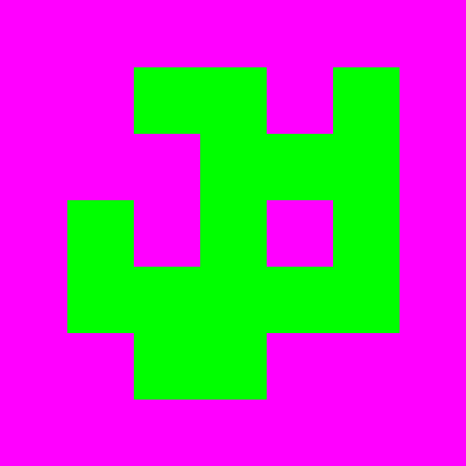
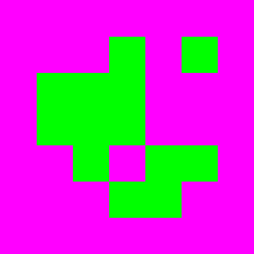
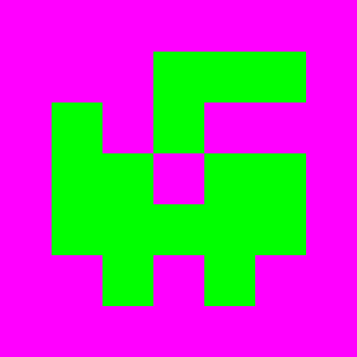
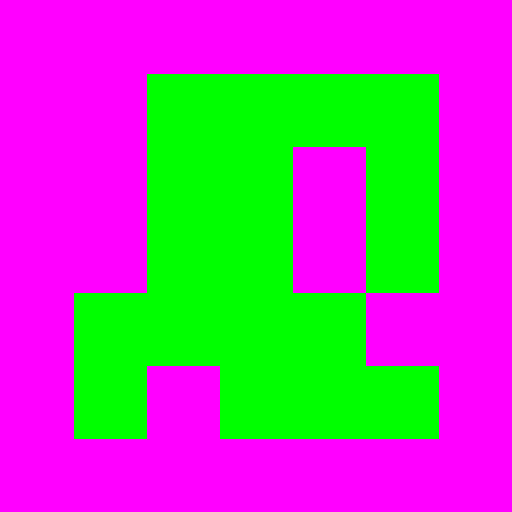

# Glossary

Abbreviation | Meaning
--- | ---
ArUco | Augmented Reality University of Cordoba
mm | millimeters

# Requirements

SSR = Space Ship Radar

---

The system shall locate the position, rotation and speed of every robot in its designated field of view

---

The system shall measure the position in mm 

---

The system shall define the coordinate origin by an ArUco-tracker (dict= cv2.aruco.DICT_5X5_50, id=6)

---

The system shall measure the rotation in mrad, with 0 representing the angle pointing straight up (y-direction)

---

The system shall measure speed in mm/s and is split into a x- and y-direction

---

The system can limit the visible area by 4 ArUco-markers

---

The GUI may make an image if the "Create picture"-button is pressed

---

## ArUco-Marker

The ArUco-markers shall be the following from the dictionary DICT_ARUCO_ORIGINAL with the IDs:
- 6 = top-left  

- 13 = top-right  

- 35 = bottom-right  

- 49 = bottom-left  

---

The designated field of view shall be restricted by the 4 ArUco-markers and is orientated to match the markers (the top-left marker needs to be in the top-left corner)

---

Pixel coordinates shall be translated to real world coordinates by using the size of the ArUco-markers or the distance between the markers
The resulting translation can have a deviation of 10% to the "real" size

## Miscellaneous

---

SSR shall be simulated in Webots

---

SSR shall communicate with a real esp-32-cam 

---

SSR shall send the position, rotation and speed with the MQTT-protocol to each robot

---

A picture of the tracked objects shall be provided under src/img

---

