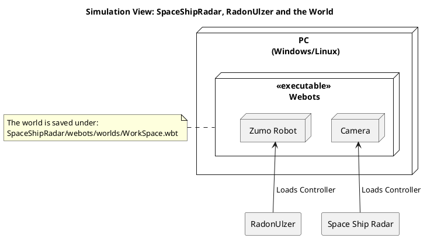

```plantuml
@startuml deployment
title Simulation View: SpaceShipRadar, RadonUlzer and the World

agent RadonUlzer
agent "Space Ship Radar"

node "PC \n (Windows/Linux)" {
    node "<<executable>> \n Webots " as Webots {
        node "Zumo Robot"
        node "Camera"
    }
}


"Camera" <-- "Space Ship Radar" : " Loads Controller"
"Zumo Robot" <-- RadonUlzer : " Loads Controller"

note left of Webots 
The world is saved under: 
SpaceShipRadar/webots/worlds/WorkSpace.wbt
end note

@enduml
```